# ArtWorkshop

ArtWorkshop is a web application designed to manage art workshops, instructors, users, and reservations. It allows users to browse available workshops, make reservations, and view their booking status, while administrators can manage workshops, instructors, and participant lists. The backend is powered by PostgreSQL and Prisma ORM, with a modern frontend built using Next.js and Tailwind CSS.

<div align="center">
  
</div>

## Getting Started

Follow these steps to set up and run the project locally:

1. Install dependencies:
```bash
npm install --legacy-peer-deps
```

2. Run database migrations:
```bash
npx prisma migrate dev
```

> [!IMPORTANT]
> To test the project correctly, you must manually execute the `prisma/data.sql` file using pgAdmin or your preferred PostgreSQL database manager. This step is required to populate the database with users, instructors, workshops, and reservations.

3. Start the development server:
```bash
npm run dev
```

Enjoy exploring and managing art workshops with ArtWorkshop!
